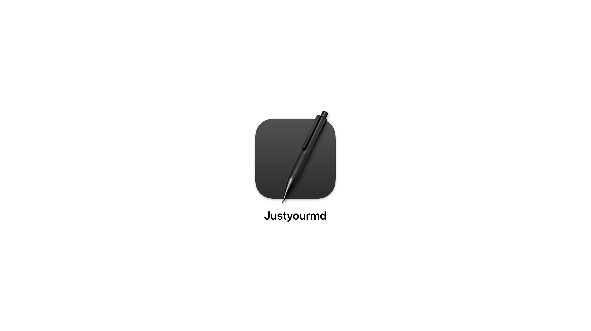

# Justyourmd

Um editor WYSIWYG nativo de Markdown para projetos web, com gerenciamento Git e preview em tempo real integrados. 🚀

## O Projeto

Cansei de abrir um IDE só para editar markdown. Tenho um "blog" baseado em markdown e estou desenvolvendo um design system com muita documentação. E mesmo com extensões, o VSCode não oferece uma experiência agradável para escrita de texto.

Então, decidi criar o Justyourmd.

Minha visão? Uma experiência de escrita gostosa que não me faça abandonar o Git ou o dev server. Código? Editor de código. Conteúdo? Justyourmd.

### Features Planejadas

- Editor WYSIWYG nativo em SwiftUI
- Gerenciamento de arquivos markdown
- Integração Git/GitHub
- Preview em tempo real

---

## Contribua

Meu foco é só frontend, então a ajuda será super bem-vinda! 🤝

1. Entre no [servidor do Discord](https://discord.gg/hNTMRb5KCz)
2. Me envie uma mensagem direta

## Roadmap 🗺️

### Fase 1 - Gerenciador de Arquivos (Atual)

- [ ] Interface do gerenciador (Estou aqui)
- [ ] Implementação do FileService
- [ ] Testes do módulo

### Fase 2 - Editor WYSIWYG

- [ ] Interface do editor
- [ ] Parser markdown
- [ ] Implementação do EditorService
- [ ] Testes do módulo

### Fase 3 - Integração Git

- [ ] Interface de controle Git
- [ ] Implementação do GitService
- [ ] Testes do módulo

### Fase 4 - Preview

- [ ] Interface de preview
- [ ] Servidor de desenvolvimento
- [ ] Testes do módulo

### Próximas Possibilidades

- [ ] Adicionar suporte para markdown com componentes (`.mdx`, `.mdsvex`)
- [ ] Completar requisitos e publicar na App Store
- [ ] Versão para Windows
- [ ] Explorar possibilidade de versão mobile

---

## Licença

Licenciado sob a Licença MIT, Copyright © 2024-presente Justyourmd.

Consulte [LICENSE](./LICENSE) para mais informações. 📄
